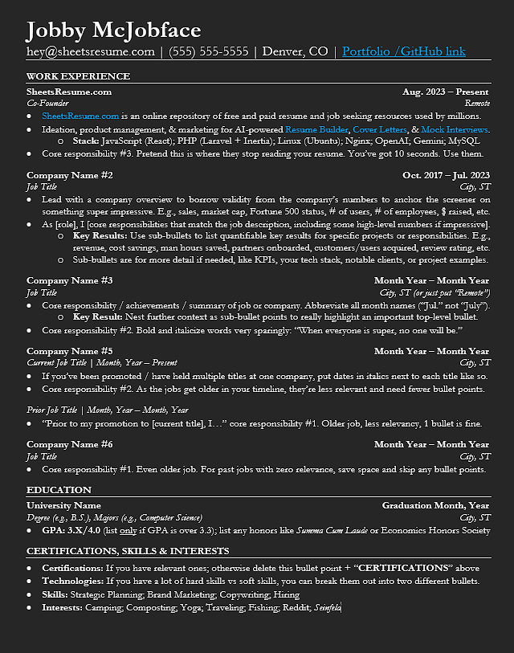
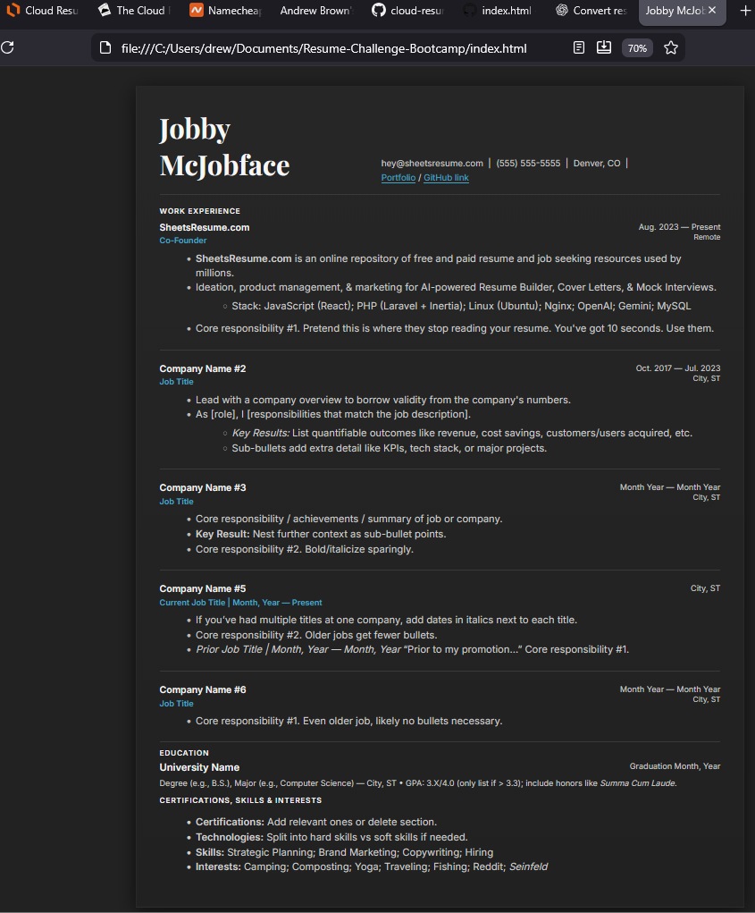

# Frontend Technical Specifications
* Static website that serves an html resume

## Resume Format
I'm using the Reddit-Famous ["Sheets" Free Resume Template](https://sheetsresume.com/resume-template)

### Resume Format Generation
I'm going to let AI help me out with generating the base HTML to minic the resume format.

Prompt to ChatGPT:
```
Convert this resume format into html
```

Image provided to LLM:



HTML/CSS generated by ChatGPT: [here](./docs/chatgpt-resume.html)

Here is a screenshot of the rendered HTML:


ChatGPT used internal CSS at first, and I decided to use a separate CSS file (external CSS) to keep it clean.
I prompted ChatGPT within the same thread `let's use a separate css file` and it provided the following:
* [index.html](./docs/chatgpt-index.html)
* [style.css](./docs/style.css)

